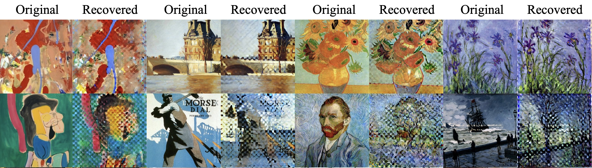
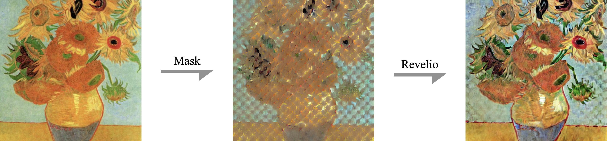

<p align="center">
<br>
<!--  -->

<br>
</p>
 
[](https://arxiv.org/abs/????)
<!-- [](https://mist-project.github.io/index_en.html) -->
<!-- [](https://colab.research.google.com/drive/1k5tLNsWTTAkOlkl5d9llf93bJ6csvMuZ?usp=sharing)
[](https://drive.google.com/drive/folders/1vg8oK2BUOla5adaJcFYx5QMq0-MoP8kk?usp=drive_link) -->

<!-- [](https://arxiv.org/abs/2310.04687) -->
<!-- 
[](https://arxiv.org/abs/2310.04687)
-->
<!-- 
### [project page](https://mist-project.github.io) | [arxiv](https://arxiv.org/abs/2310.04687) | [document](https://arxiv.org/abs/2310.04687) -->

<!-- #region -->
<!-- <p align="center">

</p> -->
<!-- #endregion -->
<!-- 
> Mist adds watermarks to images, making them unrecognizable and unusable for AI-for-Art models that try to mimic them. -->

<!-- #region -->
<p align="center">

</p>
<!-- <p align="center">

</p> -->
<!-- #endregion -->

> Revelio's Effects on WikiArt Dataset. **The first row:** Recovered images on data used during fine-tuning (membership data).
**The second row:**  Recovered images on not used during fine-tuning (holdout data). Revelio provides visualizable identification for copyright infringements.
<!-- #region -->
<!-- <p align="center">

</p> -->
<!-- #endregion -->

<!-- > Robustness of Mist against image preprocessing. -->

<!-- ## News

**2022/12/11**: Mist V2 released.  -->


## What is Revelio

Revelio is a strong copyright authentication tool that provide visualizable identification for copyright infringment during fine-tuning on diffusion models. Revelio accept a half-masked image as input and exploit the conceptual difference between pretrained and fine-tuned models. A high visual similarity can be found when the input image is used during fine-tuning while a high discrepancy can be found when it is not used during fine-tuning. For more details about both the methdology and the importance for visualizable indetification during copyright infrigements, please refer to [our paper](https://arxiv.org/abs/????).


<p align="center">

</p>


#### News
- 2024.02: Our paper about Revelio "CGI-DM: Digital Copyright Authentication for Diffusion Models via Contrasting Gradient Inversion" is accepted by CVPR 2024.

## Quick Start

### Requirements
Run following code to install requirements:

```
pip install -r requirements.txt
```

About ~ 16GB Vram is required as we need load both the pretrained and fine-tuned models to compare them.

### Fine-tuning

Provided fine-tuning code is based on [dreambooth](https:??). Run following commnad to finetune a model from vangogh's paintings and from sampled dog's images:

```
python Trainer.py
```
The model checkpoints will be saved in path 'db_prior'.

### Recovering (Revelio) 

Run following code to remove and reconstruct partial information of the given input images:

```
python Extractor.py
```

The partial representation and the reconstructed images are saved in "Recovered_Samples".

### Validating

The result is visualizable. To directly quantilize the visual effects, a  [clip]() or [dino]() model can be used, which aligns to human vision measurements. Run following command to see Acc. and AUC of revelio based on clip and dino similarity:
```
python Validator.py
```


## TODO
- [x] Revelio Implementation (2024.3.18)
- [ ] Reduce VRAM costs
- [ ] Combine with non-visual aligned measurements.


## License

This project is licensed under the Apache-2.0 license. 

## Citation:

```
@inproceedings{liang2023adversarial,
  title={Adversarial example does good: Preventing painting imitation from diffusion models via adversarial examples},
  author={Liang, Chumeng and Wu, Xiaoyu and Hua, Yang and Zhang, Jiaru and Xue, Yiming and Song, Tao and Xue, Zhengui and Ma, Ruhui and Guan, Haibing},
  booktitle={International Conference on Machine Learning},
  pages={20763--20786},
  year={2023},
  organization={PMLR}
}
```


