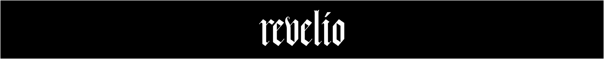

<p align="center">
<br>
<!--  -->

<br>
</p>
 
[](https://arxiv.org/abs/????)


<p align="center">

</p>


> Revelio's Effects on WikiArt Dataset. **The first row:** Recovered images on data used during fine-tuning (membership data).
**The second row:**  Recovered images on not used during fine-tuning (holdout data). Revelio provides visualizable identification of copyright infringements.


## What is Revelio

Revelio is a strong copyright authentication tool that provides visualizable identification of copyright infringement during fine-tuning on diffusion models. Revelio accepts a half-masked image as input and exploits the conceptual difference between pretrained and fine-tuned models. A high visual similarity can be found when the input image is used during fine-tuning while a high discrepancy can be found when it is not used during fine-tuning. For more details about the methodology,  please refer to [our paper](https://arxiv.org/abs/????). It also discusses the importance of visual identification in the context of copyright authentication.


<p align="center">

</p>


#### News
- 2024.02: Our paper about Revelio "CGI-DM: Digital Copyright Authentication for Diffusion Models via Contrasting Gradient Inversion" is accepted by CVPR 2024.

## Quick Start

### Requirements
Run following code to install requirements:

```
pip install -r requirements.txt
```


### Fine-tuning

Provided fine-tuning code is based on [dreambooth](https://github.com/huggingface/diffusers/blob/main/examples/dreambooth/train_dreambooth.py). Run following command to fine-tune a model from Van Gogh's paintings and from sampled dog's images:

```
python Trainer.py
```
The model checkpoints will be saved in path `db_prior`.

### Recovering (Revelio) 

Run the following code to remove and reconstruct partial information of the given input images:

```
python Extractor.py
```

`>= 16GB Vram` is required as we need load both the pretrained and fine-tuned models to compare them. The partial representation and the reconstructed images are saved in `Recovered_Samples`.

### Validating

The result is visualizable. To directly quantify the visual effects, a  [clip](https://github.com/openai/CLIP) or [dino](https://github.com/facebookresearch/dino) model can be used, which aligns to human vision measurements. Run following command to see Acc. and AUC of revelio based on clip and dino similarity:
```
python Validator.py
```


## TODO
- [x] Revelio Implementation (2024.3.18)
- [ ] Reduce VRAM costs
- [ ] Combine with non-visual aligned measurements.


## License

This project is licensed under the Apache-2.0 license. 

## Citation:

```
@inproceedings{???
}
```


